#              TASK: -> ROLE-BASED ACCESS CONTROL(RBAC)-UI

<h3> Admin Dashboard for User, Role, and Permission Management </h3>

<h6>This project is an admin dashboard designed for managing users, roles, and permissions efficiently.
It implements Role-Based Access Control (RBAC) features, providing an intuitive interface for administrators to assign roles, define permissions, and manage users securely.</h6>

# 
<h3> Thanking VRV security for giving me this opportunity to make this assignment in a given time frame. </h3>

#
<H3> NOW, Let's want to discuss the approach </H3>

<h4>1. Understand the Requirements</h4>
User Management: Admins can add, edit, delete users, and give them roles (like Admin or User). 
Role Management: Admins create roles (like Admin, Editor) and assign them to users. 
Permissions: Each role gets permissions (like "Read," "Write," "Delete") that define what the user can do. 
Connections: Users → Roles → Permissions. Roles decide what users can do.
<h4>2. Design the Interface</h4>
Make Separate Pages for managing users, roles, and permissions.
Add simple forms and buttons for easy actions like adding and editing.
<h4>3. Setup Fake Backend (Mock APIs)</h4>
Use mock APIs to test adding and updating users and roles without a real database.
These APIs help simulate real data actions like adding a user or changing a role.
<h4>4. Build the User Interface (Frontend)</h4>
Use React.js to build interactive pages.
Show data in tables, and let admins add/edit details with forms and buttons.
<h4>5. Link Everything Together</h4>
For example, when adding a user, the page calls the mock API to add the user, then updates the list of users automatically.
<h4>6. Style the Page</h4>
Use CSS to make the app look nice and easy to use, with readable text and buttons.
<h4>7. Test the App</h4>
Test everything: adding users, editing roles, and assigning permissions.
Make sure everything works, and if there are errors (like missing data), handle them well.

#

<h3>This is the folder structure </h3>

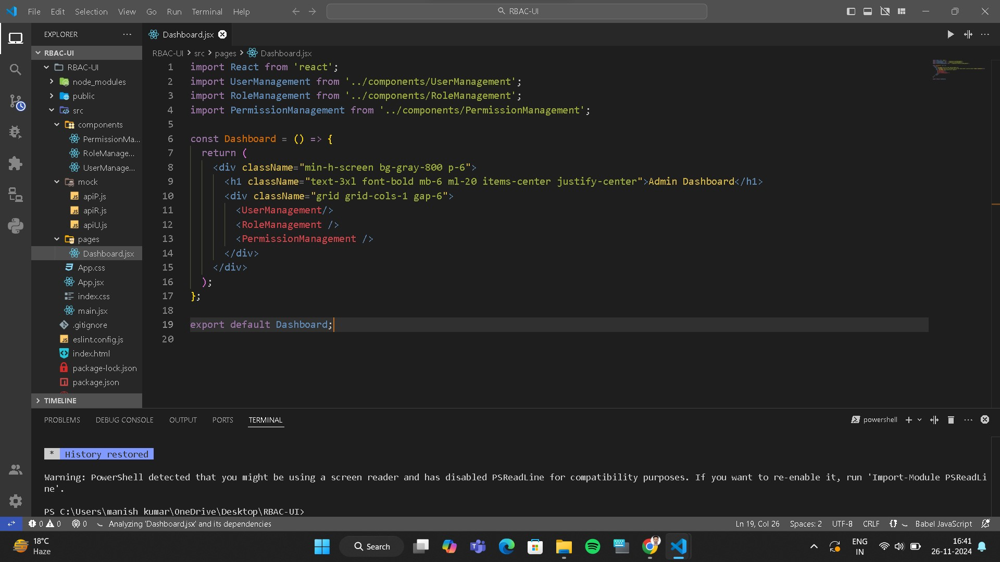

#

<h3> This is package.json file </h3>

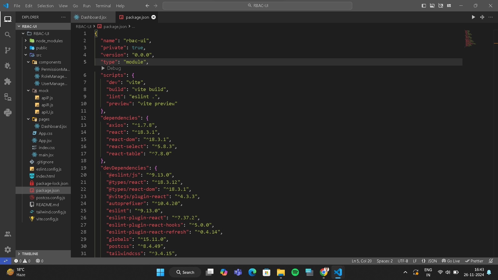

#

<h3><i>I used vite and react.js to create this projects so command for create the project is npm create vite@latest 
and for run the project it would be npm run dev as dev is dependencies in pavkage.json whose meaning is vite to run the project so the screenshot is </i></h3>

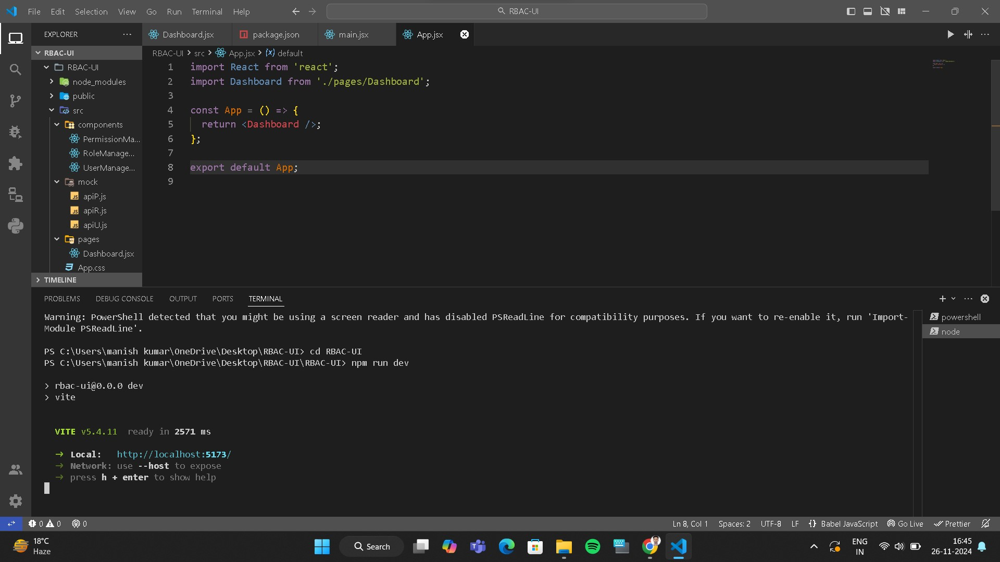

# 

<h2> Output of projects </h2>

#

<h3> UserManagement :-> User Management is a crucial feature in any system, allowing administrators to efficiently control and oversee user accounts. It involves creating, updating, and deleting users, managing user details such as their names and emails, and controlling their access and permissions within the application.</h3>
<h4> Sample output </h4>

<h5>SampleUser</h5>
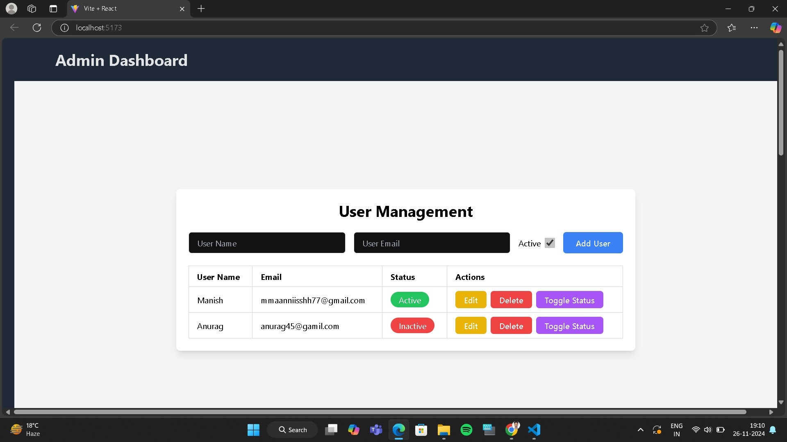
<h5>AddUsers</h5>
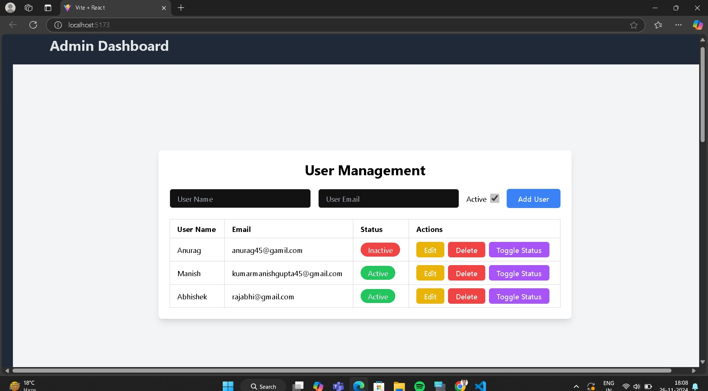
<h5>deleteUser</h5>
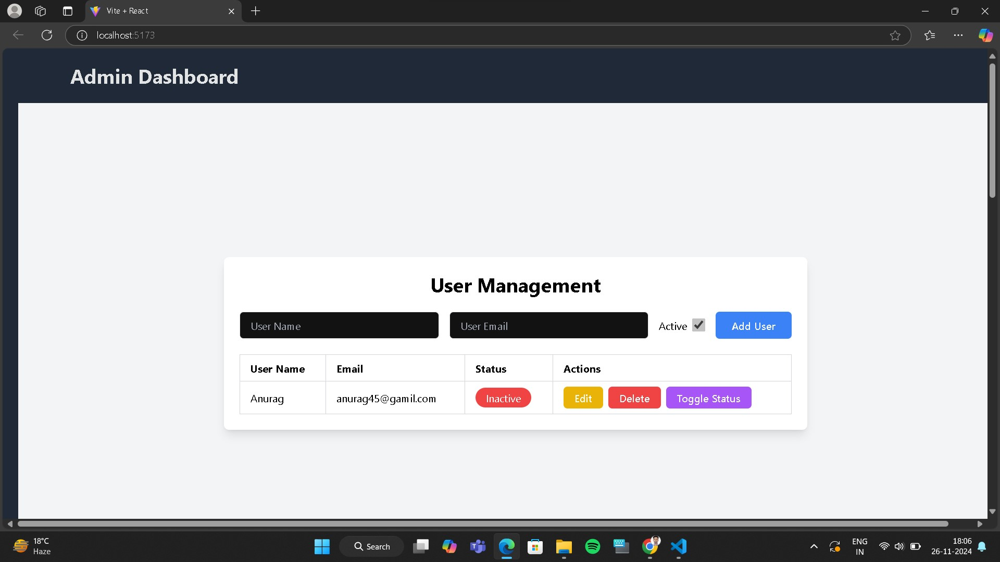
<h5>updateUser</h5>
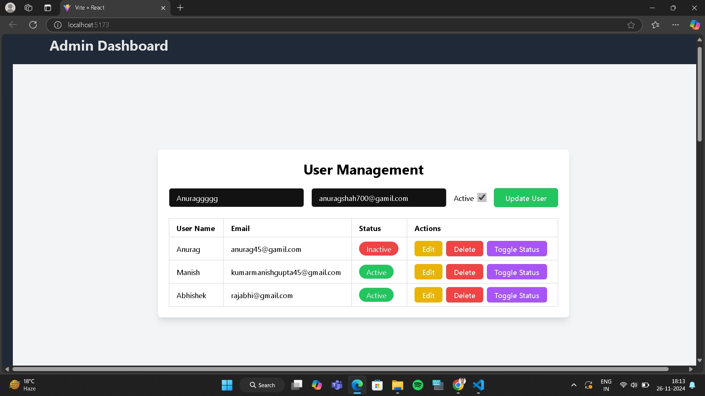

#

<h3> RoleManagement -> Role Management is a key part of a Role-Based Access Control (RBAC) system, where roles are defined and assigned to users to determine what actions they can perform within the system. Each role corresponds to a set of permissions that define the user’s access level.</h3>
<h4> Sample output </h4>

<h5>SampleUser</h5>
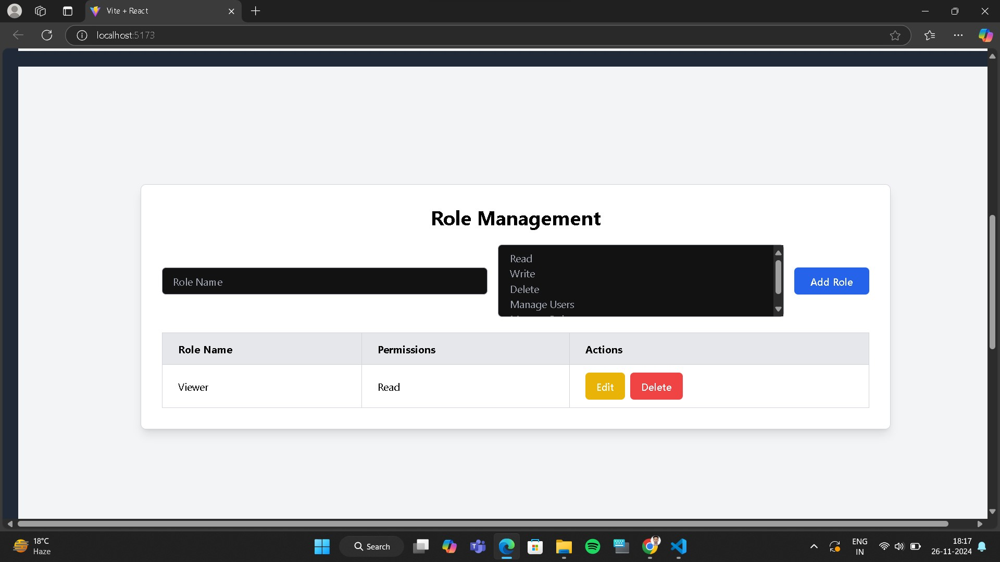
<h5>AddUsers</h5>
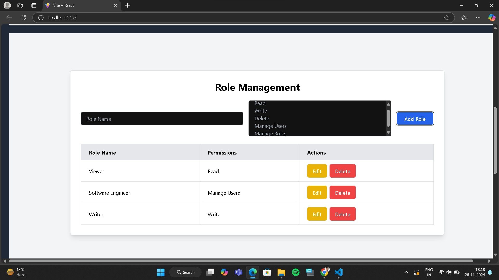
<h5>deleteUser</h5>
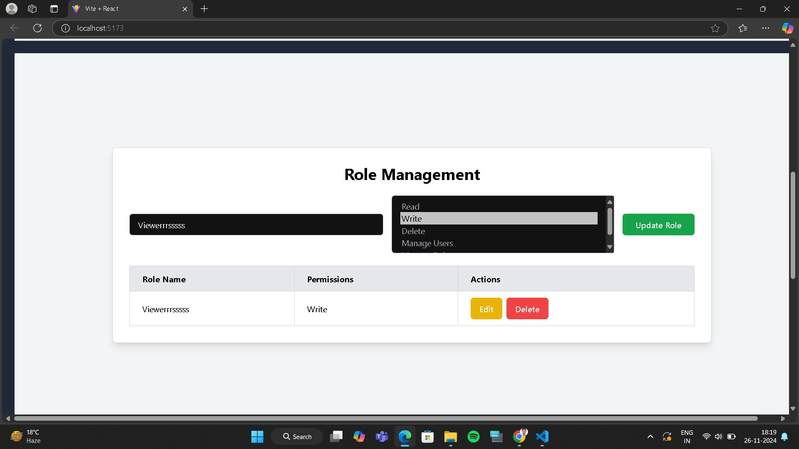
<h5>updateUser</h5>
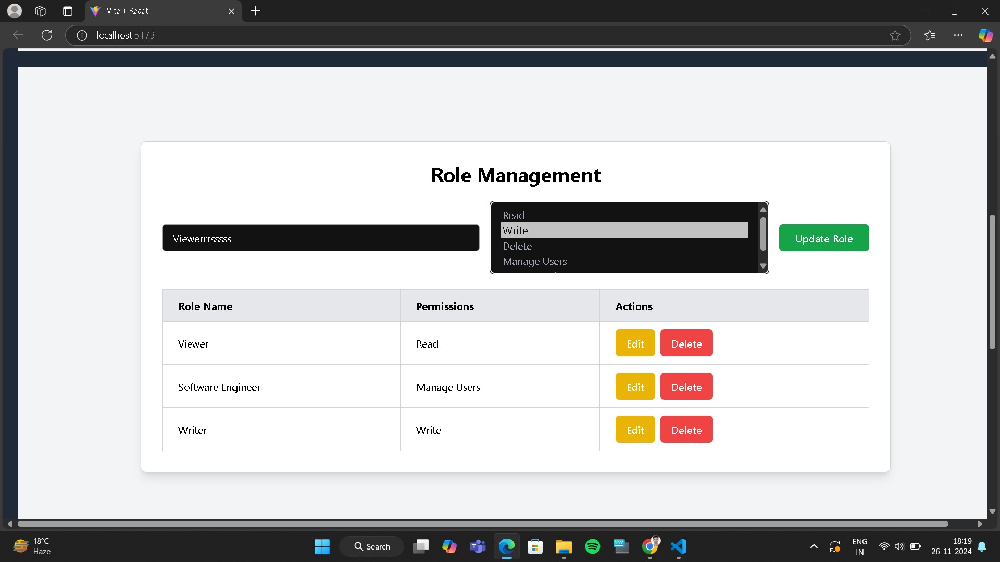

#

<h3> PermissionManagement -> Permission Management is a vital component of a Role-Based Access Control (RBAC) system, which allows administrators to define and control what actions users can perform within an application. It involves creating, updating, and assigning permissions to different roles, such as Read, Write, and Delete permissions.</h3>
<h4> Sample output </h4>

<h5>SampleUser</h5>
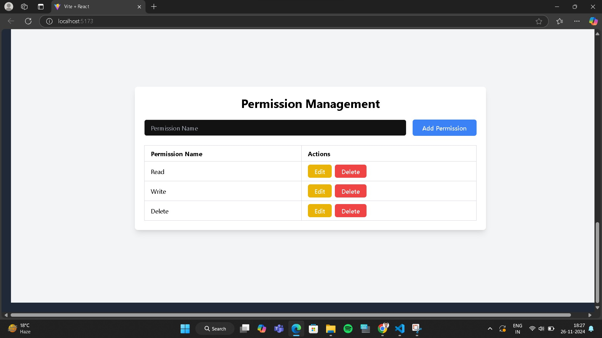
<h5>AddUsers</h5>
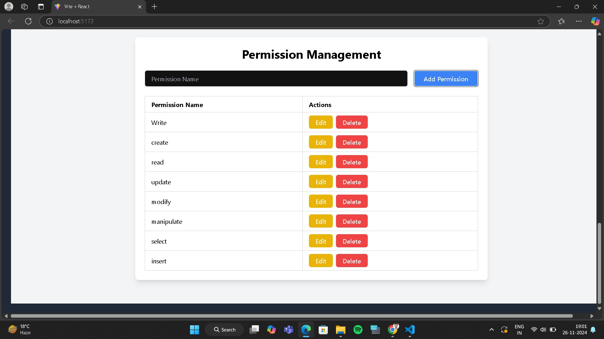
<h5>deleteUser</h5>
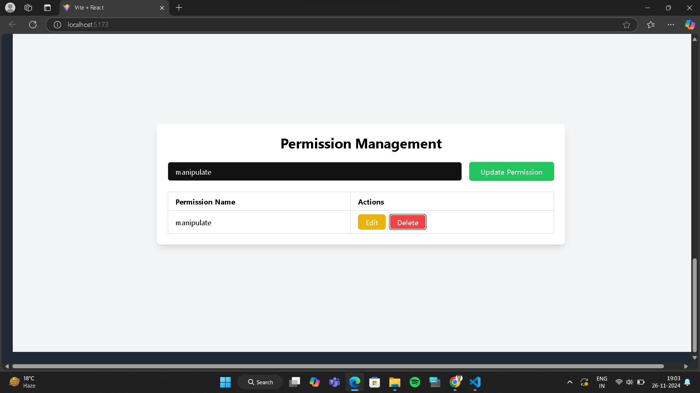
<h5>updateUser</h5>
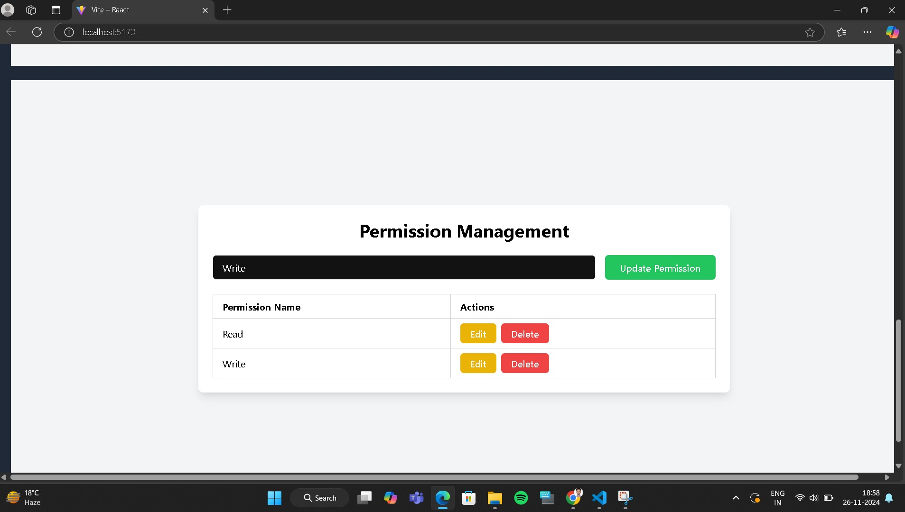

#  Thank You for considering my work.
